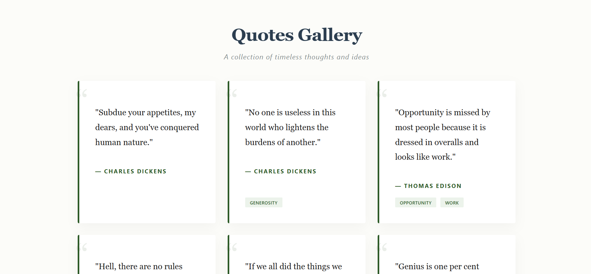
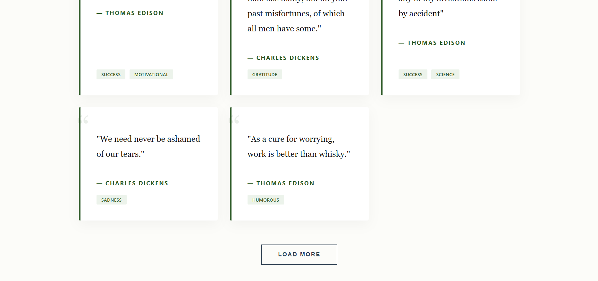

# Quotes Gallery App

A clean and minimal **Quotes Gallery UI** built using React, focused on delivering a smooth reading experience with a modern and elegant design.

---

## Live Demo

(https://quotes-gallery-timeless-thoughts.netlify.app/)

---

## Overview

This project fetches quotes from a public API and displays them in a beautifully designed card layout.

The goal of this project was to move beyond basic API rendering and focus on:

* UI/UX clarity
* Clean component structure
* Real-world frontend patterns (loading, error handling, pagination)

---

## Features

* Quotes displayed in a responsive grid layout
* Clean and minimal UI focused on readability
* Pagination with "Load More" functionality
* Loading state handling
* Error handling with fallback UI
* Tags display for each quote (if available)
* Fully responsive design

---

## Tech Stack

* **Frontend:** React (Vite)
* **Styling:** CSS (custom, no framework)
* **API:** FreeAPI Quotes Endpoint

---

## Project Structure

```
quotes-gallery/
│
├── src/
│   ├── components/
│   │   └── QuoteCard.jsx
│   │
│   ├── App.jsx
│   ├── App.css
│   └── main.jsx
```

---

## Installation & Setup

```bash
# Clone the repository
git clone https://github.com/coderTejas565/quotes-gallery.git

# Navigate to project
cd quotes-gallery

# Install dependencies
npm install

# Start development server
npm run dev
```

---

## API Used

```
GET https://api.freeapi.app/api/v1/public/quotes?page=1&limit=10
```

---

## Key Learnings

This project helped in understanding:

* How to handle API responses properly
* Managing multiple UI states (loading, error, empty)
* Designing reusable components (`QuoteCard`)
* Implementing pagination in frontend
* Writing clean and maintainable UI code

---

## Future Improvements

* Add "Favorite Quotes" (localStorage)
* Copy-to-clipboard feature
* Search / filter quotes
* Add animations & micro-interactions
* Add authentication (save personal quotes)

---

## Screenshots

## 📸 Screenshot





---

## Acknowledgements

* FreeAPI for providing public APIs
* Inspiration from modern minimal UI design principles

---

## ⭐ If you like this project

Give it a ⭐ on GitHub and share your feedback!

---