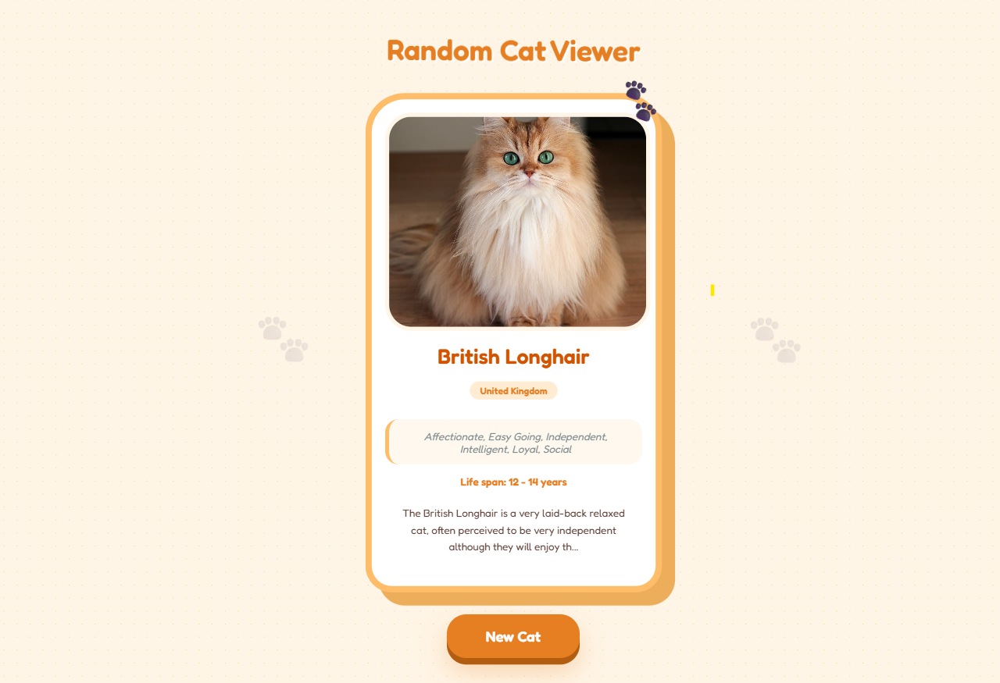

# Random Cat Viewer

A simple frontend application that fetches and displays random cat data using a public API. This project focuses on understanding API integration, state management, and dynamic UI rendering in React.

---

## Overview

The Random Cat Viewer demonstrates how frontend applications interact with APIs to fetch and display real-time data. Each request returns a new cat with details such as breed, temperament, origin, and image.

The goal of this project is to build a strong foundation in handling asynchronous data and creating clean, responsive UI components.

---

## Features

* Fetch random cat data from an API
* Display cat image and breed information
* Show details like origin, temperament, and life span
* Handle loading states during API calls
* Gracefully handle errors
* Clean and minimal UI design

---

## Tech Stack

* React (Vite)
* JavaScript (ES6+)
* CSS

---

## API Used

```
GET https://api.freeapi.app/api/v1/public/cats/cat/random
```

---

## Project Structure

```
random-cat-viewer/
│── src/
│   ├── components/
│   │   └── CatCard.jsx
│   ├── App.jsx
│   ├── App.css
│   └── main.jsx
│
│── assets/
│   └── screenshot.png
│
│── index.html
│── package.json
│── README.md
```

---

## Installation

Clone the repository:

```
git clone https://github.com/coderTejas565/random-cat-viewer.git
```

Navigate into the project:

```
cd random-cat-viewer
```

Install dependencies:

```
npm install
```

Run the development server:

```
npm run dev
```

---

## Screenshot




---

## What I Learned

* How to fetch and handle API data in React
* Managing loading and error states
* Structuring reusable UI components
* Rendering dynamic data into the UI
* Building small projects to strengthen fundamentals

---

## Future Improvements

* Add a "Next Cat" button for fetching new data
* Improve UI with animations
* Add favorite/save functionality
* Display more structured breed information

---

## Conclusion

This project focuses on building real understanding of how data flows from an API to the UI. It is a small but important step toward building scalable frontend and full-stack applications.
